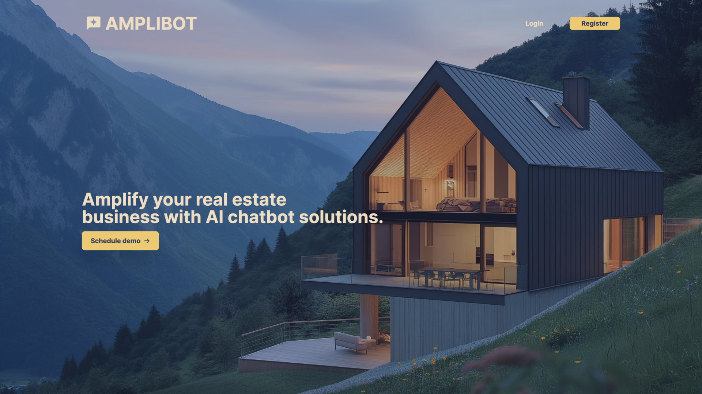

# AMPLIBOT

## 🤖 About

AMPLIBOT is an intelligent web-based chatbot powered by a locally-run open-source Large Language Model (LLM). Web-based chatbot using local Llama3 that can provide contexual responses based on the current state.

## 🌟 Features

- Web-based interface with responsive design (desktop and mobile views)
- Conversation history and context maintenance
- Integration with a local open-source LLM for natural language processing
- Secure user authentication and management using AWS Cognito
- Data storage using Amazon DynamoDB
- Intelligent information gathering for inbound sales
- Real-time interactions
- Session management for personalized user experiences

## 🛠 Tech Stack

- Frontend: [Next.js](https://nextjs.org/)
- Backend: [FastAPI](https://fastapi.tiangolo.com/)
- LLM: [Meta Llama3](https://llama.meta.com/llama3/)
- Database: [AWS DynamoDB](https://docs.aws.amazon.com/amazondynamodb/latest/developerguide/Introduction.html)
- Authentication: [AWS Cognito](https://docs.aws.amazon.com/cognito/latest/developerguide/what-is-amazon-cognito.html)
- Deployment: [AWS Amplify](https://docs.aws.amazon.com/managedservices/latest/userguide/amplify.html)

## 🚀 Getting Started

### Prerequisites

- Node.js (v18.18.0 or higher)
- npm (v10.8.1 or higher)
- AWS account (for Amplify, Cognito, and DynamoDB)

### Installation

[Installation steps to be added]

## 📚 Usage

1. Sign up or log in to the application using AWS Cognito authentication.
2. Start a conversation with AMPLIBOT.
3. AMPLIBOT will guide you through a series of questions to gather information about your real estate needs.
4. View your conversation history and gathered information in the user dashboard.

## 🧠 Chatbot Capabilities

AMPLIBOT is designed to gather the following information through natural conversation:

- Customer name
- End goal (e.g., buying a condo, house, etc.)
- Budget
- Timeframe
- Available down payment
- Current work with a lender
- Additional concerns or questions
- Contact information for follow-up

## 📱 Mobile Support

AMPLIBOT is fully responsive and provides an optimized experience on mobile devices. [in progress]

## 🔒 Security

- User authentication and management are handled securely through AWS Cognito.
- All data is stored in Amazon DynamoDB with appropriate security measures.
- The backend is not open to the public and is secured within a VPC.

## 🛠 Development

Folder Structure
~~~
AMPLIBOT/
├── amplibot-nextjs/
├── amplibot-backend/
└── amplibot-reactnative/
~~~

- amplibot-nextjs: Next.js frontend application. It's responsible for the web interface, routing, and rendering of the chatbot.
- amplibot-backend: Backend services, including the Python server and integration with DynamoDB. It handles the core logic, data processing, and API endpoints for the chatbot.
- amplibot-reactnative: React Native mobile application, providing a native mobile experience for iOS and Android users.

## 📈 Future Enhancements

- Multi-language support
- Advanced analytics dashboard
- General real estate prompt responses
- Free form data states

## 👥 Authors

- [Marco Li](https://github.com/ycmarcoli@gmail.com)

## 🙏 Acknowledgements

- [Meta Llama3](https://llama.meta.com/llama3/)
- [AWS Documentation](https://docs.aws.amazon.com/)
- [Amazon DynamoDB Documentation](https://docs.aws.amazon.com/amazondynamodb/latest/developerguide/Introduction.html)
- [AWS Cognito Documentation](https://docs.aws.amazon.com/cognito/latest/developerguide/what-is-amazon-cognito.html)
- [React Documentation](https://reactjs.org/docs/getting-started.html)
- [Guidance AI](https://github.com/guidance-ai/guidance)
- [Huggingface Transformers](https://huggingface.co/docs/transformers/index)
